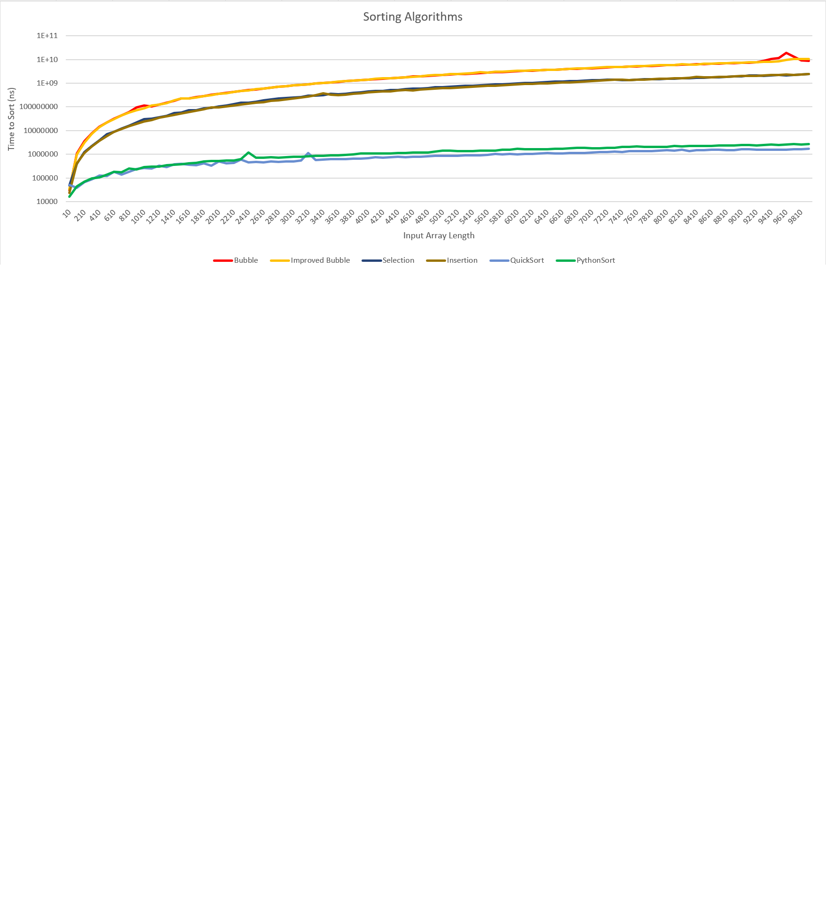

# Sorting Algorithms

This repository consists of 2 files:
- **sortingAlgorithms.py**: implements different classic sorting algorithms (Bubble, ImprovedBubble, Selection, Insertion, QuickSort and PythonSort) on a random array
- **compareAlgorithms.py**: performs load tests runing the algorithms in the other file for different input array lengths and creates a .csv file with the results

It can be possible to run each script separately. Run the following comand in your system:
```bash
python sortingAlgorithms.py 1 100
```
Where the first param, from 1 to 6, stands for the type of algorithm to use:
1. Bubble
2. ImprovedBubble
3. Selection
4. Insertion
5. QuickSort
6. PythonSort
And the second param is the length of the input random array

This script has been configured to be silent, therefore it will not throw any output unless debug prints are commented out inside of the file.


The following command runs all the sorting algorithms defined in the sortingAlgorithms script with different input array lengths ranging from 10 to 10000 in steps of 100 (configurable). 
```bash
python compareAlgorithms.py
```
This creates the results.csv file with the time it took to run the sorting algorithm in nanoseconds for each input length. These results can be graphed.

This is the result of the sorting algorithms comparative run in my system:


